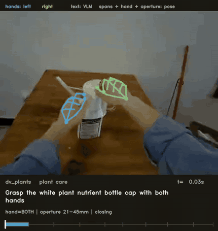

# ego-annotate

Dense action annotation for egocentric manipulation video. Feed it raw `.mcap`
episodes — head camera, 21-joint hand pose, calibration — and it produces
**~29 validated atomic captions per minute** of footage.



*One shelf-stocking cycle, cut into four atomic actions — grasp, transport,
place, release. Hand skeleton is reprojected from the shipped pose; the caption
and the measured fields sit below it, with span boundaries on the timeline.
Longer 52-second version across three domains — pick-and-place, non-prehensile,
personal care: [`assets/demo.mp4`](assets/demo.mp4).*

## The idea

**Anything pose can measure, pose measures.** The vision-language model is
asked only for what it can actually see.

| From motion capture | From the VLM |
|---|---|
| span boundaries, acting hand, grasp aperture and its trend, rotation direction, finger state | `text`, `verb`, `noun`, `visibility`, `uncertain` |

That split buys two things. The model cannot get boundaries or handedness
wrong, because it never proposes them. And its output can be *checked* against
the measurements — a caption saying "pinch" while the fingers were measurably
opening is a detectable error, not an opinion.

## How it works

```
.mcap ──▶ quality ──▶ events ──▶ features ──▶ spans ──▶ caption ──▶ score
```

| Stage | What it does |
|---|---|
| **quality** | Four tiers of per-clip record. Hard rejects (blur, exposure, framing, pose glitches), a head-motion score, hand framing. No learned filter anywhere, so the accept/reject boundary is auditable. Blur floors are *calibrated* against deliberately degraded copies of the same frames, and the tier is proved by fault injection. |
| **events** | Contact/release from **grasp aperture** (thumb-tip to index-tip), since no object poses ship and depth is never delivered. Contacts snap to the nearest wrist-jerk peak. Plus five actionness states with hysteresis: `manipulate → reach → reposition → inspect → idle`. |
| **features** | Per-finger curl, a 1-D closure score (PC1 of the 21-joint configuration, canonicalised into a hand-local frame so the PCA describes *shape*, not orientation), wrist kinematics, and validity flags that are propagated rather than imputed. |
| **spans** | Cuts annotation units at troughs in a **combined activity signal** — max of normalised wrist speed, aperture rate and twist rate. Wrist speed alone is the wrong cue: unscrewing a cap barely moves the wrist. Then enforces the label rules' duration band and drops spans inside rejected clips. |
| **caption** | Prompts a VLM per batch of spans, with the measured facts as context. Backends: `stub`, `anthropic`, `openai` (vLLM / SGLang / llama.cpp / LM Studio), `qwen-local`. |
| **score** | Format (the rule set), diversity (uniqueness + a Heaps projection), and grounding (does the caption agree with what pose measured). |

Label rules live in [`egoannot/labels/atomicity.py`](egoannot/labels/atomicity.py)
as **executable code** — A0 schema, A1 span, A2 length, A3 one action core, A4
field/text consistency, A5 enums, A6 banned phrasing, A7 tense, A8 no overlap,
A9 no contradiction of a measurement. A label is atomic iff it raises no error.
Vocabulary is shared by the prompt and the linter from one file, so they cannot
drift apart.

## Quickstart

```bash
pip install -r requirements.txt
export EGO_CORPUS=/path/to/mcap/root     # or: ln -s /path/to/root corpus
python -m egoannot paths                 # check what resolved

make all                                 # full build, stub backend
make test                                # 67 tests
```

Any stage runs on its own:

```bash
python -m egoannot quality measure
python -m egoannot spans   build
python -m egoannot caption run --backend qwen-local
python -m egoannot score
python -m egoannot demo --segments pp_shampoo:1.9:10 --gif demo.gif
```

Every path and threshold is in [`egoannot/config.py`](egoannot/config.py), each
with a comment saying where the number came from.

## Results

269 spans over 9.4 minutes, 17 segments, 8 action classes, captioned with a
local Qwen3-VL-8B:

| | |
|---|---|
| Density | **28.6 labels/min** |
| Atomicity | **75%** pass all rules |
| Uniqueness | **66.9%** (Heaps-projected 40% at n=10,000) |
| Duration band | **100%** in band, 0 violations |
| Grounding | 52% verb/aperture agreement (48% is the chance floor) |
| Throughput | 0.62 spans/s, 1.3× realtime on one RTX 4090 |

Both demo clips above are reproducible from the committed artifacts:

```bash
python -m egoannot demo --segments pp_shampoo:1.9:10.2 --gif assets/demo.gif \
    --gif-fps 7 --gif-width 400 --gif-colors 48
python -m egoannot demo --segments pp_shampoo:1.9:20 np_storagebox:0:16 \
    dv_contactlens:0:16 --out assets/demo.mp4
```

Batch size is measured, not assumed — 5 spans per call beats 1 on atomicity
(75% vs 67%), uniqueness (66.9% vs 56.1%) and length discipline (0 vs 15
over-long captions) at identical throughput.

## What's honest about it

- **Contact events are not ground truth.** Three independent checks failed to
  confirm them; against human gold the detector reaches F1 0.02–0.09. They are
  a proposal layer, which is why no caption is ever conditioned on one.
- **Depth is declared but never delivered.** A calibrated stereo pair ships and
  was tested properly: the hand pose *is* registered to the imagery, but cannot
  support proximity (correlation ≈ 0, MAE 75–251 mm). Full resolution made it
  worse, so the failure is stereo at hand boundaries, not resolution.
- **Caption correctness is unmeasured.** Format and diversity never check that
  "white ceramic bottle" is a white ceramic bottle, and human gold covers 2 of
  8 action classes. Grounding is a partial, pose-derived substitute.
- **Hand-visibility tier does not discriminate** on this corpus: the shipped
  pose is near-rigidly coupled to the head camera, so the in-FOV rate is 1.000
  everywhere. Lateral pose error also varies by episode, which is visible in
  the demo overlay.
- **No walking in this sample.** `reposition` means leaning and weight shifts.
- Thresholds are specific to 1920×1456 and these sampling rates. Re-run
  `quality calibrate` and `events calibrate` on new footage.

## Docs

- [`docs/pipeline.md`](docs/pipeline.md) — stage-by-stage reference
- [`docs/quality.md`](docs/quality.md) — quality tiers, calibration, limits
- [`docs/events.md`](docs/events.md) — the event detector and its negative results
- [`docs/labeling_spec.md`](docs/labeling_spec.md) — what an atomic caption is, and why
