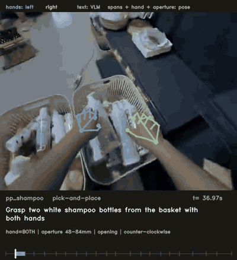
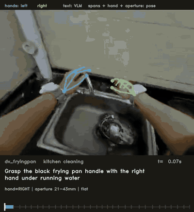

# ego-annotate

Dense action annotation for egocentric manipulation video. Feed it raw `.mcap`
episodes — head camera, 21-joint hand pose, calibration — and it produces
**~29 validated atomic captions per minute** of footage.

```
.mcap ──▶ quality ──▶ events ──▶ features ──▶ spans ──▶ caption ──▶ score
          └ Part 2 ┘  └──────────────── Part 1 ────────────────────┘
```

Two parts, in the order you'd care about them: **[Part 1](#part-1--dense-annotation)**
is how the labels get made, **[Part 2](#part-2--video-quality)** is how footage
is judged fit to label in the first place.

---

# Part 1 — Dense annotation

<table>
<tr>
<td width="50%"></td>
<td width="50%"></td>
</tr>
<tr>
<td><b>Pick-and-place.</b> One stocking cycle, cut into four atomic spans &mdash;
grasp, transport, place, release.</td>
<td><b>Kitchen cleaning.</b> Same pipeline, no retuning. The panel carries every
measured field, including <code>clockwise</code> read off the hand pose.</td>
</tr>
</table>

Hand skeletons are reprojected from the shipped pose; the caption and the
measured fields sit below each frame, with span boundaries on the timeline.
Longer 52-second version across three domains:
[`assets/demo.mp4`](assets/demo.mp4).

## The idea

**Anything pose can measure, pose measures.** The vision-language model is
asked only for what it can actually see.

| From motion capture | From the VLM |
|---|---|
| span boundaries, acting hand, grasp aperture and its trend, rotation direction, finger state | `text`, `verb`, `noun`, `visibility`, `uncertain` |

That split buys two things. The model cannot get boundaries or handedness
wrong, because it never proposes them. And its output can be *checked* against
the measurements — a caption saying "pinch" while the fingers were measurably
opening is a detectable error, not an opinion.

## How it works

1. **events** — contact/release from **grasp aperture** (thumb-tip to
   index-tip), since no object poses ship and depth is never delivered.
   Contacts snap to the nearest wrist-jerk peak. Plus five actionness states
   with hysteresis: `manipulate → reach → reposition → inspect → idle`.
2. **features** — per-finger curl, a 1-D closure score (PC1 of the 21-joint
   configuration, canonicalised into a hand-local frame so the PCA describes
   *shape*, not orientation), wrist kinematics, and validity flags that are
   propagated rather than imputed.
3. **spans** — cuts annotation units at troughs in a **combined activity
   signal**: the max of normalised wrist speed, aperture rate and twist rate.
   Wrist speed alone is the wrong cue — unscrewing a cap barely moves the
   wrist. The duration band is enforced *at cut time*, so the captioner is
   never marked down for a boundary it did not choose, and spans inside
   rejected clips are dropped.
4. **caption** — prompts a VLM per batch of spans with the measured facts as
   context. Backends: `stub`, `anthropic`, `openai` (vLLM / SGLang /
   llama.cpp / LM Studio), `qwen-local`.
5. **score** — format (the rule set), diversity (uniqueness + a Heaps
   projection), and grounding (does the caption agree with what pose measured).

Label rules live in [`egoannot/labels/atomicity.py`](egoannot/labels/atomicity.py)
as **executable code** — A0 schema, A1 span, A2 length, A3 one action core, A4
field/text consistency, A5 enums, A6 banned phrasing, A7 tense, A8 no overlap,
A9 no contradiction of a measurement. A label is atomic iff it raises no error.
Vocabulary is shared by the prompt and the linter from one file, so they cannot
drift apart.

## Results

269 spans over 9.4 minutes, 17 segments, 8 action classes, captioned with a
local Qwen3-VL-8B:

| | |
|---|---|
| Density | **28.6 labels/min** |
| Atomicity | **75%** pass all rules |
| Uniqueness | **66.9%** (Heaps-projected 40% at n=10,000) |
| Duration band | **100%** in band, 0 violations |
| Grounding | 52% verb/aperture agreement (48% is the chance floor) |
| Throughput | 0.62 spans/s, 1.3× realtime on one RTX 4090 |

Batch size is measured, not assumed — 5 spans per call beats 1 on atomicity
(75% vs 67%), uniqueness (66.9% vs 56.1%) and length discipline (0 vs 15
over-long captions) at identical throughput.

## Tested against a vision-only baseline

The premise &mdash; that pose should supply boundaries and handedness &mdash; was an
assumption until it was measured. `python -m egoannot baseline run` is the control
arm: the same 8B model, same rules, same verb list, same footage, shown frames and
asked to segment the clip itself. It gets a *larger* frame budget (384 vs 276) so
it is not handicapped. On five domains, 151 s:

| | pose-guided | vision-only |
|---|---|---|
| passes the atomicity spec | **87%** | 63% |
| unique captions | **77%** | 62% |
| spans inside the 1.3–4.0 s band | **100%** | 68% |
| labels/min, first 16 s of a clip | 26.6 | 45.4 |
| labels/min, after 16 s | **28.3** | 5.2 |
| hand matches measured pose | supplied | 67% |
| verb matches measured aperture | 66% | **79%** |

The vision-only arm front-loads badly: it annotates the opening of each clip at
45/min, then emits a single 16-second "action" per window thereafter. It also
disagrees with the measured acting hand on a third of its labels.

But it wins on grounding. Choosing its own boundaries, it cuts where the action it
describes actually happens; the pose-guided arm must caption whatever the measured
boundary contains. **That is a real cost of fixed boundaries and it was not
predicted.** Reproduce with `python -m egoannot baseline compare`.

## What's honest about it

- **Contact events are not ground truth.** Three independent checks failed to
  confirm them; against human gold the detector reaches F1 0.02–0.09. They are
  a proposal layer, which is why no caption is ever conditioned on one.
- **Depth is declared but never delivered.** A calibrated stereo pair ships and
  was tested properly: the hand pose *is* registered to the imagery, but cannot
  support proximity (correlation ≈ 0, MAE 75–251 mm). Full resolution made it
  worse, so the failure is stereo at hand boundaries, not resolution.
- **Caption correctness is unmeasured.** Format and diversity never check that
  "white ceramic bottle" is a white ceramic bottle, and human gold covers 2 of
  8 action classes. Grounding is a partial, pose-derived substitute.
- **No walking in this sample.** `reposition` means leaning and weight shifts.

## Reproduce the demos

```bash
GIF="--gif-fps 6 --gif-width 400 --gif-colors 40 --gif-dither none"
python -m egoannot demo --segments pp_shampoo:1.9:8.2  --gif assets/demo-pickplace.gif $GIF
python -m egoannot demo --segments dv_fryingpan:0:8.7  --gif assets/demo-kitchen.gif   $GIF
python -m egoannot demo --segments pp_shampoo:1.9:20 np_storagebox:0:16 \
    dv_contactlens:0:16 --out assets/demo.mp4
```

`id:start:duration` windows a segment in clip-local seconds. `--gif-dither none`
matters: GIF size here is driven by camera motion, and dithering costs ~30% for
no visible gain on this footage.

---

# Part 2 — Video quality

Before anything is captioned, every 4-second clip gets a quality record. The
deliverable is one JSON line per clip in
[`artifacts/quality/clip_quality.jsonl`](artifacts/quality/clip_quality.jsonl).

```bash
python -m egoannot quality calibrate --all   # derive thresholds from the footage
python -m egoannot quality selftest  --all   # fault injection: prove the rejects fire
python -m egoannot quality measure           # write the clip records
python -m egoannot quality report            # re-print from existing records
```

## Four tiers

| Tier | What it does | Learned? |
|---|---|---|
| **T1** | hard rejects: duration, missing modality, blur, exposure, implausible pose jumps | no — by design |
| **T2** | head-motion score (optical flow, 4 fps, 256×256); drops the top 30% **within each episode** | no |
| **T3** | hand framing from the shipped pose + calibration (21 joints, both hands) | no |
| **T4** | the per-clip record itself — every measurement, plus the accept/reject and its reasons | — |

Nothing here is learned. A learned filter at the hard-reject tier would encode a
model's opinion of what egocentric video should look like and bake that bias
into every dataset built downstream, so the accept/reject boundary is kept
auditable instead.

## Two things make it more than a threshold dump

**Thresholds are calibrated, not guessed.** `quality calibrate` scores real
frames, then scores deliberately *degraded copies of the same frames*:

- tile Laplacian variance p10 = 0.5 → `lowtex_floor = 0.5` (masks flat/de-ID tiles)
- real frame sharpness p5 = 4.8; Gaussian σ=3 blur p95 = 3.8 → `blur_floor = 4.0`

**The tier is proved by fault injection.** T1 rejects nothing on clean footage,
so the only way to show it works is to break real clips in each way it claims to
catch and confirm it fires — `quality selftest`
([`egoannot/stages/quality.py:470`](egoannot/stages/quality.py)) does exactly
that, and it runs in the test suite.

## What it measured

363 clips, 17 episodes, 23.6 minutes in:

| | clips | |
|---|---|---|
| T1 hard reject | 41 | 11.3% |
| T2 motion drop | 88 | 24.2% |
| **accepted** | **234** | **64.5%** — 15.4 min |

T1 reasons: 27 blurred, 8 poorly-framed hands, 7 too short, 1 no decoded
frames, 1 out of exposure range.

Only **T1 gates the span stage**. T1 is a defect finding; T2 removes 30% of
every episode by construction, so gating on it would throw away good footage.

## Frame rate is not constant

This sample contains both 30 fps and 25 fps episodes. `session/metadata`
declares the rate correctly per camera, and the stage reads it and cross-checks
against the observed message rate (`fps_mismatch` flag; 0 mismatches here).
Assuming a single rate skews the decoded timeline — a 25 fps episode read as
30 fps drifts frame-to-clip mapping by 17% and the clip tail decodes as empty.

## What it cannot do

- **T3 does not discriminate on this corpus.** Full-frame hand in-FOV rate is
  exactly **1.000** in every episode. The shipped pose is near-rigidly coupled
  to the head camera — hand spread is 12–65 cm in world frame but only 3–12 cm
  in camera frame — so the pose stream cannot recover image-space hand
  position, and "clips without hands" cannot be identified from it.
  `hand_central50_rate` is kept as the one pose-derived variant with any
  spread. A real hand-visibility signal needs a detector on pixels, in its own
  declared tier. In-FOV is also not the same as unoccluded: occlusion by the
  body, the shelf or the held object is invisible to a projection test.
- **Mild blur is out of reach.** σ=1.5 blur is not separable from this
  footage's own soft frames (only 71% of sharp frames score above its p95). The
  filter catches moderate-to-severe blur only.
- **T2 must rank within an episode.** Optical-flow magnitude is
  scene-dependent, so a pooled percentile turns T2 into an episode selector
  rather than a clip filter — under pooled ranking `belts_a` lost every clip
  and `stockout_b` lost 67%. `motion_scope="episode"` is the default;
  `"global"` restores the old behaviour.
- **Thresholds are corpus-specific**, tied to 1920×1456 and these sampling
  rates. Re-run `quality calibrate` and `events calibrate` on new footage.

---

## Quickstart

```bash
pip install -r requirements.txt
export EGO_CORPUS=/path/to/mcap/root     # or: ln -s /path/to/root corpus
python -m egoannot paths                 # check what resolved

make all                                 # full build, stub backend
make test                                # 67 tests
```

Any stage runs on its own:

```bash
python -m egoannot quality measure
python -m egoannot spans   build
python -m egoannot caption run --backend qwen-local
python -m egoannot score
python -m egoannot demo --segments pp_shampoo:1.9:8.2 --gif demo.gif
```

Every path and threshold is in [`egoannot/config.py`](egoannot/config.py), each
with a comment saying where the number came from.

## Docs

- [`docs/pipeline.md`](docs/pipeline.md) — stage-by-stage reference
- [`docs/quality.md`](docs/quality.md) — quality tiers, calibration, limits
- [`docs/events.md`](docs/events.md) — the event detector and its negative results
- [`docs/labeling_spec.md`](docs/labeling_spec.md) — what an atomic caption is, and why
